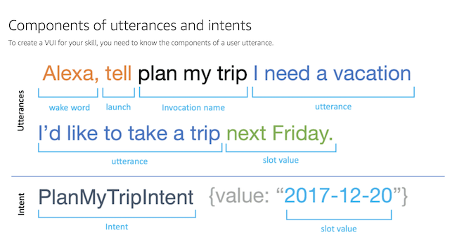
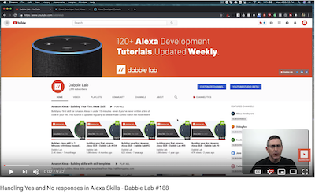
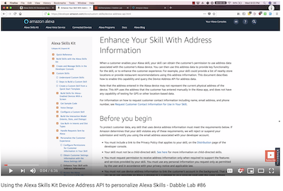
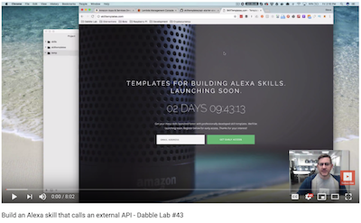

# IDK: I Don't Know 

### Table of Contents

* [Additional Readme](#addreadme)
* [About Application](#aboutapp)
* [About Us](#aboutus)
* [Images](#images)
* [Written Resources](#wresources)
* [Video Resources](#vresources)

### Additional Readme 

* [Trello](https://trello.com/b/1hskw7YL/idk)
* [Team Agreement](./assets/TEAMAGREEMENT.md)
* [User Stories](./assets/USERSTORIES.md)
* [General Project Description](./assets/pitch.md)
* [Software Requirements](./assets/software-requirements.md)
* [ASK CLI usage workflow](./assets/ask-setup.md)
* [Project Data Flow](./assets/data-flow.pdf)

**[Return to Top](#top)**

### About the Application 

The "I don't know..." Skill eliminates the headache, "hanger", and indecision about choosing where you or a group want to eat! This Skill saves basic user preferences, asks the user to choose from two different food categories, pulls from the Yelp API, and gives back a suggestion following the users preferences.

**[Return to Top](#top)**

### About Us 
  
**Jack Kinne**
* [LinkedIn](https://www.linkedin.com/in/jackdkinne/)
* [GitHub](https://github.com/Bravelemming)
* Bio: Software Developer. Strongly educated professional with a Bachelor's degree in Computer Science and English Education from Humboldt State University. I'm into yoga and fighting with swords, and love volunteering with my local community.

**Nicholas Paro**
* [LinkedIn](https://www.linkedin.com/in/nparo/)
* [GitHub](https://github.com/paronicholas)
* Bio: I am a software developer at Amazon and I currently work in the Alexa domains on the Healthcare team. I am working on my Bachelor's degree in Computer Science from Southern New Hampshire University and I have a Bachelor of Fine Arts in Music Theory and Composition from Carnegie Mellon University. A fun fact about me is that I enjoy doing custom woodworking - wood turning, cutting boards, and custom boxes.

**Melfi Perez**
* [LinkedIn](https://www.linkedin.com/in/melfiperez/)
* [GitHub](https://github.com/perezm27)
* Bio: I am an SDE at Amazon with the Alexa Semantics team. I have my B.S from Montclair State University and a fun fact about me is that I’ve been to 19 different states and love to go on road trips.

**Matt Stuhring**
* [LinkedIn](https://www.linkedin.com/in/mattstuhring/)
* [GitHub](https://github.com/mattstuhring)
* Bio: What up I'm Matt Stuhring. Software Developer Engineer on the Amazon Healthcare team. Something interesting about me is that I follow English Premier League soccer. Go Manchester United!!!
  
**[Return to Top](#top)**

### Images 

**[Return to Top](#top)**

### Written Resources 
* [Build A Skill End-to-end](https://developer.amazon.com/docs/hosted-skills/build-a-skill-end-to-end-using-an-alexa-hosted-skill.html#)
* [ASK CLI Install](https://developer.amazon.com/docs/ask-toolkit/get-started-with-the-ask-toolkit-for-visual-studio-code.html#install-the-ask-toolkit-in-vs-code)
* [ASK CLI Reference](https://developer.amazon.com/docs/smapi/ask-cli-command-reference.html)
* [Alexa Yelp](https://github.com/Yelp/yelp-fusion/blob/master/fusion/node/sample.js)
* [Alexa Device Address](https://developer.amazon.com/docs/custom-skills/device-address-api.html)

### Video Resources 
* Yes or No Response

* Enhance Your Skill with Address Information

* Alexa External API Call

**[Return to Top](#top)**
