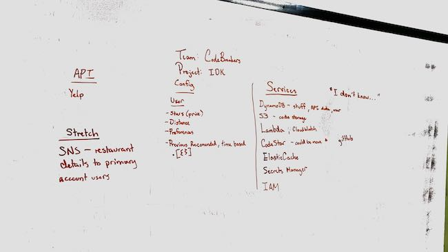

# Team Code Breakers: Team Agreement

### Members
* Melfi Perez
* Nick Paro
* Jack Kinne
* Matt Stuhring

### Application
* An Alexa Skill named "I don't know..."

### MVP

### Communication plan: 
* Slack 
* Hours of Operation:
  * 9-5ish
* Questions can be asked after our hours of operation, but don’t expect a response

* Location:
  * Code Fellows

### Conflict plan: 
* What will your group do when it encounters conflict?
  * We will address what is going on, so that we can better understand their perspective.
  * If there’s a conflict in ideas, we will have a discussion to lay out the pros and cons.  From there we will decide what will be feasible to do in the amount of time we have.
  * What will your process be to resolve it?
  * We will be receptive and value constructive feedback. The whole group will listen.
  * We will actively listen to the person’s concerns
  * If it’s something that we cannot solve, we will bring in a neutral 3rd party for help.

### Work plan:
* Use CodeStar to manage team and code
* Team members can work on what they’d like
* Have a team leader for each day to keep us on track

### Git process:
* We will have a master and a dev branch
* Feature branches will be branched off of dev
* Changes will be pushed to dev
* The person to approve a PR will be a person who did not write the code. <3
* At the end of each day and if the dev branch is to everyone’s satisfaction, it will be pushed to master.
* Everyone needs to pull from master to get the updated code
