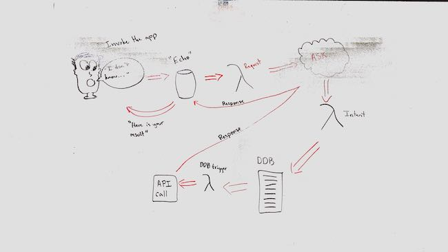

## Vision
- The vision of this product is to make an easy, voice interface for suggesting places to eat.  
- We want to limit recommendations by distance, allow the user to add & remove members from their group, send an SMS text to notify all memebers of the group of restaurant selection, and eventually use this to make recommendations based on user preferences.  

## What pain point does this project solve?
- This eliminates the headache of trying to choose a restaurant when you don't know what you want to eat. 
- The intention is to reduce "hanger" and indecision about food choices, especially in group conversations.  

## Why should we care about your product?
- Its easy, it's helpful, it reduces stress especially for couples and groups.
- It's hard to make choices when you're hungry.  So don't. 

## Scope (In/Out)
### IN - What will your product do
- allow voice to alexa.
- allow groups to be made.
- allow users to add memebers to their group.
- allow users to be removed from a group.
- Send Resturant choice to all memebers of the group.
- limit recommendations by area.
- get data from yelp API
- save and persist data

### OUT - What will your product not do.
- Will not reserve a table at a location.
- Will not have a GUI interface.
- Current version does not support saving user preferences.
- Will not filter restaurants by food type.

## MVP
What will your MVP be. What is your expected minimum end product?
- Alexa skill.
- Engaged invocation phrases. 
- With utterances which we capture and manipulate.  
- Yelp API to gather local restaurants.
- Uses the following AWS services:  
- Codestar. 
- DynamoDB.
- Lambda.
- IAM.
- S3.

## Stretch
- groups
- texts
- books
- adding user preferences
- saving user preferences
- making recommendations based on user preferences
- other cateogory searches

## Functional Requirements
- A user can ask for a restaurant
- a user can set location distance
- a user can persist skill session
- A user can update add & remove members from their group.

## Non-Functional Requirements
- Usability Testing
We will be focusing on usability and integration testing for voice activation of utterances, to ensure a good product and
responsive architecture.
- Ease of Access
This product must be easy for users to engage with, with references our previous point.  Adding an user to a group must be quick, so we
will add the current user to a group by default, in case a user needs a recommendation immediately.  Being quick is critical, 
as we want to be a source of relief and not stress for the userbase. 

## Data Flow

